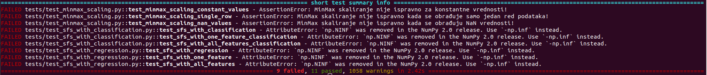
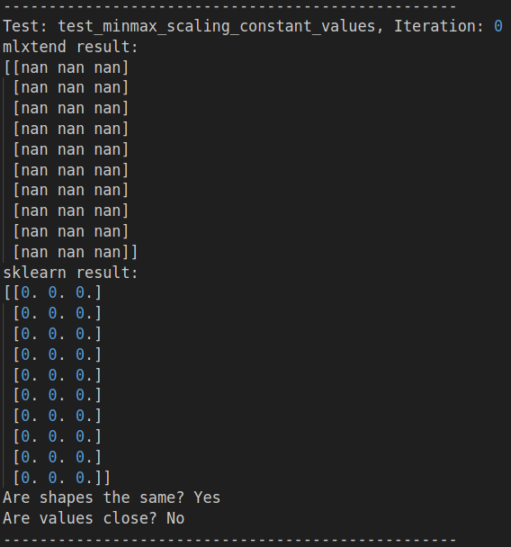
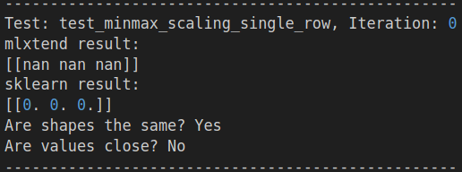
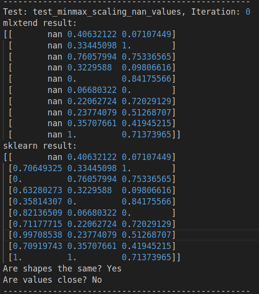
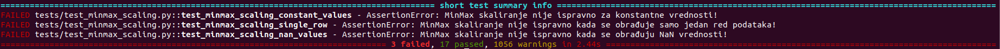
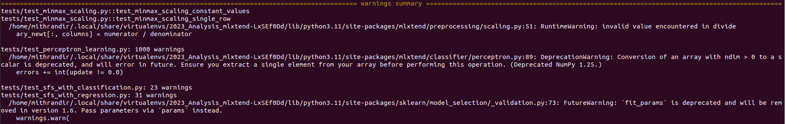

# Izveštaj o analizi projekta: `mlxtend`

Kao što je spomenuto u [README.md](./README.md) fajlu, `mlxtend` je Python biblioteka koja pruža širok spektar alata namenjenih za svakodnevne zadatke u oblasti Data Science-a, uključujući izbor atributa, klasifikaciju, regresiju, obradu podataka, evaluaciju modela i vizualizaciju. U nastavku sledi detaljan izveštaj o analizi i verifikaciji ovog projekta.

## Uvod

U okviru ove analize koristiće se različiti alati za verifikaciju i testiranje softvera, pri čemu će svaki alat biti kratko opisan zajedno sa njegovom primenom u nastavku izveštaja.

### Lista korišćenih alata:
- [pytest](#pytest) - jedinično (eng. unit) i integraciono (eng. integration) testiranje.
- [Alat Y](#alat-y)
- [Alat Z](#alat-z)
- [Alat W](#alat-w)
- [Alat V](#alat-v)

## pytest

`pytest` je popularna biblioteka za testiranje u Pythonu, koja omogućava jednostavno pisanje i organizovanje testova. Omogućava automatizovano izvršavanje testova, detekciju grešaka i generisanje detaljnih izveštaja o izvršenim testovima. `pytest` je fleksibilan i podržava različite pristupe testiranju, uključujući funkcionalne, jedinične (unit) testove, kao i složenije scenarije testiranja poput integracionog testiranja. Više informacija o `pytest` biblioteci možete pronaći na [zvaničnoj stranici](https://docs.pytest.org/en/latest/).

Za praćenje pokrivenosti u oba slučaja (jedinično i integraciono testiranje) korišćena je biblioteka [coverage.py](https://coverage.readthedocs.io/en/7.6.1/).

S obzirom na to da je priroda jediničnih, a kasnije i integracinih testova takva da je neophodno makar osnovno poznavanje koda koji će se testirati, može biti relevantna napomena da autor ima osnovnog iskustva u prethodnom korišćenju (i analizi) ove biblioteke u, pre svega, edukacione svrhe. Još jedna napomena da u sklopu ove biblioteke postoji nemali broj testova, koji već testiraju razne funkcionalnosti sistema. Štaviše, na zvaničnoj strani projekta se i nalaze neki aktivni problemi (bagovi), koje je potrebno rešiti. Prilikom ove analize uložen je određeni napor da testovi ne budu ponavljani, ali se ujedno i ne daje garancija da ponavljanja testova dostupna u glavnom repozitorijumu neće biti.

Kod nekih testova korišćena je referentna vrednost dobijena korišćenjem pokretanja istih algoritama iz biblioteke [sklearn](https://scikit-learn.org/stable/), koja je verovatno i najkorišćenija biblioteka u ovoj oblasti, koju gađa i biblioteka koju mi analiziramo. U nekim slučajevima korišćenje referentne vrednosti nema smisla. Npr. poređenje vrednosti predikcija nema naročitog smisla, jer je u redu da ove dve biblioteke imaju donekle različit pristup rešavanja problema, pa samim tim i nešto drugačije predikcije po instancama. U dokumentima koji sadrže rezultate izvršavanja se mogu pronaći razlike u predikcijama, ali one nisu korišćene kao parametar za testiranje. Ipak, u određenim slučajevima korišćenje referentne vrednosti ima smisla, pa je tada i korišćena (npr. `nan` vs `0` ili kad je vrednost deterministička u odnosu na ulaz).

### Unit testovi

Za jedinično testiranje odabrane su sledeće fukncionalnosti koje će biti testirane:
- [EnsembleVoteClassifier](https://rasbt.github.io/mlxtend/api_subpackages/mlxtend.classifier/#ensemblevoteclassifier)
    - Da li je dužina predikcija jednaka dužini uzorka? ✅
    - Da li su sve predikcije iz skupa validnih klasa? ✅

    Na ova pitanja odgovarano je različitim testovima, odnosno "izazivanjem" modifikovanjem parametara  (npr. `hard` i `soft` parametri, koji određuju princip glasanja).
- [Perceptron](https://rasbt.github.io/mlxtend/api_subpackages/mlxtend.classifier/#perceptron)
    - Da li ovaj algoritam radi valjano, odnosno da li se greška vremenom smanjuje na linearno razdvojivim podacima? ✅
- [minmax_scaling](https://rasbt.github.io/mlxtend/api_subpackages/mlxtend.preprocessing/#minmax_scaling)
    - Da li je Min-Max skaliranje ispravno za konstantne vrednosti? ❌
    - Da li je ispravno za vrednosti sa velikim opsegom (velike razlike između vrednosti)? ✅
    - Da li je ispravno za negativne vrednosti? ✅
    - Da li je ispravno kada imamo samo jedan red podataka? ❌
    - Da li dobro obrađuje slučaj kada radi sa praznom listom? ✅
    - Da li dobro radi sa nedostajućim (nan) vrednostima? ❌
    
    U ovom slučaju korišćeno je referenciranje na vrednosti dobijene korišćenjem Min-Max skaliranja iz sklearn biblioteke s obzirom da bi ovaj proces trebalo da daje isti rezultat u bilo kojim okolnostima. Zanimljivo, u ovom modulu pronađeno je nekoliko grešaka, koje će u nastavku biti analizirane. Ipak, videćemo da je najčešći problem u radu sa nedostajućim vrednostima.
- [SequentialFeatureSelector](https://rasbt.github.io/mlxtend/api_subpackages/mlxtend.feature_selection/#sequentialfeatureselector) za rešavanje problema klasifikacije, ali i regresionog problema.
TODO vidi kad središ
    - Da li se radi sa odgovarajućim brojem atributa nakon što se taj broj podesi? ✅
    - Da li se koristi odgovarajući *scoring*, koji je prethodno podešen? ✅
    - Da li je vrednost *R2 score* u problemu regresije veća od 0? Iako jeste problem prilikom razvoja, jer negativna vrednost ukazuje da nešto definitivno ne radimo kako treba, u ovom slučaju ne treba upirati prstom samo u algoritam, već i u osobu koja koristi. Tačnije, korisno je testirati ovo ako je određivanje ove vrednosti automatizovano da bi se ukazalo programeru da obrati pažnju. ✅
    - Da li radi korektno (izbacuje odgovarajući izuzetak) ako prosledimo prazan skup? ✅

Testovi su dostupni u folderu `unit_tests/tests` i pokreću se na jedan od dva sledeća načina:

```
cd unit_tests
python run_tests.py
```
ili, ukoliko se koristi `pipenv` i instalirane sledećom komandom:
```
pipenv run pytest unit_tests/tests/
```

#### Analiza i zaključci

Inicijalnim pokretanjem implementiranih testova dobijeni su sledeći rezultati: 


Možemo videti da su detektovani sledeći problemi:

1. U 6/9 navrata vidimo da korišćenje zastarelog konstrukta izaziva grešku, koja onemogućava program   da nastavi izvršavanje:
    
    AttributeError: `np.NINF` was removed in the NumPy 2.0 release. Use `-np.inf` instead.
    ```
    Korišćenje `np.NINF` treba zameniti konstruktom `-np.inf`. Napomena da okruženje u kojem se testira koristi verziju biblioteke [NumPy 2.1.0](https://numpy.org/devdocs/release/2.1.0-notes.html#), te da se ovaj propust može donekle tolerisati, ako uzmemo u obzir da se u praksi i dalje često koriste verzije ove biblioteke 1.x. Ipak, ovo je neophodno promeniti u budućnosti kako se garantovalo izvršavanje na novijim sistemima, odnosno okruženjima koja koriste nove verzije popularnih biblioteka.
2. Sledeći problem koji se javlja u `tests/test_minmax_scaling.py::test_minmax_scaling_constant_values` je:
    ```
    AssertionError: MinMax skaliranje nije ispravno za konstantne vrednosti!
    ```
    U jednom od komentara u biblioteci navedeno je:
    ```python
    # Notes
    # ----------
    # If all values in a given column are the same, these values are all
    # set to `0.0`. The standard deviation in the `parameters` dictionary
    # is consequently set to `1.0` to avoid dividing by zero.
    ```
    Ipak, testiranjem je utvrđeno da su ove vrednosti nan kao što se može videti u logu.

    
3. Naredni problem se javlja u `tests/test_minmax_scaling.py::test_minmax_scaling_single_row` i u pitanju je:
    ```
    AssertionError: MinMax skaliranje nije ispravno kada se obrađuje samo jedan red podataka!
    ```
    Problem je sličan kao u prethodnom slučaju:

    
4. Poslednji problem nastao koji je takođe nastao zbog lošeg rada s `nan` vrednostima se javlja u `tests/test_minmax_scaling.py::test_minmax_scaling_nan_values` i u pitanju je:
    ```
    AssertionError: MinMax skaliranje nije ispravno kada se obrađuju NaN vrednosti!
    ```
    Problem je sličan kao u prethodnom slučaju s tim što je sada situacija nešto složenija. Možemo primetiti da postojanje jedne nedostajuće vrednosti utiče na to da cela kolona biva popunjena nedostajućim vrednostima dok u slučaju sklearn biblioteke, vrši se čišćenje tih vrednosti, pa se na onome što je preostalo vrši skaliranje.

    

Nakon odgovarajuće promene (`np.NINF` treba zameniti konstruktom `-np.inf`) dobijamo novi rezultat testiranja, na osnovu kojeg zaključujemo da nam preostaju samo greške kod Min-Max skaliranja, a da `SequentialFeatureSelector` sada uspešno prolazi sve testove:



Preostaje nam još i veliki broj upozorenja (`1056 warnings`), te se na sledećoj slici može videti i kratak izveštaj o najvažnijim od njih. Možemo primetiti da je najčešće u pitanju zastarivanje određenih jezičkih konstrukta u narednim verzijama korišćenih biblioteka.



TODO: Komentar nakon sređivanja koda za nanove. Svi testovi prolaze...

#### Pokrivenost


### Integraciono testiranje

#### Zaključci

#### Pokrivenost


## alat-y

### Zaključci
Zaključci o upotrebi Alata Y.

## alat-z

### Zaključci
Zaključci o upotrebi Alata Z.

## alat-w

### Zaključci
Zaključci o upotrebi Alata W.


## Zaključak


