# Izveštaj o analizi projekta: `mlxtend`

Kao što je spomenuto u [README.md](./README.md) fajlu, `mlxtend` je *Python* biblioteka koja pruža širok spektar alata namenjenih za svakodnevne zadatke u oblasti *Data Science*-a, uključujući izbor atributa, klasifikaciju, regresiju, obradu podataka, evaluaciju modela i vizualizaciju. U nastavku sledi detaljan izveštaj o analizi i verifikaciji ovog projekta.

## Uvod

U okviru ove analize koristiće se različiti alati za verifikaciju i testiranje softvera, pri čemu će svaki alat biti kratko opisan zajedno sa njegovom primenom u nastavku izveštaja.

### Lista korišćenih alata:
- [pytest](#pytest) - jedinično (eng. *unit*) i integraciono (eng. *integration*) testiranje.
- [pylint](#pylint)
- [Alat Z](#alat-z)
- [Alat W](#alat-w)

## pytest

`pytest` je popularna biblioteka za testiranje u *Python*-u, koja omogućava jednostavno pisanje i organizovanje testova. Omogućava automatizovano izvršavanje testova, detekciju grešaka i generisanje detaljnih izveštaja o izvršenim testovima. `pytest` je fleksibilan i podržava različite pristupe testiranju, uključujući funkcionalne, jedinične (unit) testove, kao i složenije scenarije testiranja poput integracionog testiranja. Više informacija o `pytest` biblioteci možete pronaći na [zvaničnoj stranici](https://docs.pytest.org/en/latest/).

Za praćenje pokrivenosti u oba slučaja korišćena je biblioteka [coverage.py](https://coverage.readthedocs.io/en/7.6.1/). 

**Napomena 1:** *S obzirom na to da je priroda jediničnih, a kasnije i integracionih testova takva da je neophodno makar osnovno poznavanje koda koji će se testirati, može biti relevantna napomena da autor ima minimalno iskustvo u prethodnom korišćenju (i analizi) ove biblioteke u, pre svega, edukacione svrhe. Još jedna napomena da u sklopu ove biblioteke postoji nemali broj testova, koji već testiraju razne funkcionalnosti sistema. Štaviše, na zvaničnoj strani projekta se i nalaze neki aktivni problemi (bagovi), koje je potrebno rešiti. Prilikom ove analize uložen je određeni napor da testovi ne budu ponavljani, ali se ujedno i ne daje garancija da ponavljanja testova dostupna u glavnom repozitorijumu neće biti.*


**Napomena 2:** *Kod nekih testova korišćena je referentna vrednost dobijena korišćenjem pokretanja istih algoritama iz biblioteke [sklearn](https://scikit-learn.org/stable/), koja je verovatno i najkorišćenija biblioteka u ovoj oblasti, koju pokriva i biblioteka koju mi analiziramo. U nekim slučajevima doduše korišćenje referentne vrednosti nema smisla. Npr. poređenje vrednosti predikcija modela nema naročitog smisla u generalnom slučaju, jer je u redu da ove dve biblioteke imaju donekle različit pristup rešavanja problema, pa samim tim i nešto drugačije predikcije po instancama. U dokumentima koji sadrže rezultate izvršavanja se mogu pronaći razlike u predikcijama, ali one nisu korišćene kao parametar za testiranje. Ipak, u određenim slučajevima korišćenje referentne vrednosti ima smisla, pa je tada i korišćena (npr. `nan` vs `0` ili kad je vrednost deterministička u odnosu na ulaz).*

### Jedinično i integraciono testiranje

Svi testovi, i jedinični i integracioni, pokretani su odjednom. 
```
cd pytest
python run_tests.py
```
ili, ukoliko se koristi `pipenv` sledećom komandom iz korenog direktorijuma projekta:
```
pipenv run pytest pytest_tool/unit_tests/tests/ pytest_tool/integration_tests/tests/
```
i na kraju, ukoliko je aktivirano okruženje u kojem je instalirana biblioteka `pytest`, testiranje se može pokrenuti sledećom komandom, takođe iz korenog direktorijuma projekta:
```
pytest pytest_tool/unit_tests/tests/ pytest_tool/integration_tests/tests/
```

*Podrazumeva se da su instalirane neophodne biblioteke.*

### Jedinični testovi

Za jedinično testiranje odabrane su sledeće fukncionalnosti koje će biti testirane:
- [minmax_scaling](https://rasbt.github.io/mlxtend/api_subpackages/mlxtend.preprocessing/#minmax_scaling)
    - Da li je Min-Max skaliranje ispravno za konstantne vrednosti? ❌
    - Da li je ispravno za vrednosti sa velikim opsegom (velike razlike između vrednosti)? ✅
    - Da li je ispravno za negativne vrednosti? ✅
    - Da li je ispravno kada imamo samo jedan red podataka? ❌
    - Da li dobro obrađuje slučaj kada radi sa praznom listom? ✅
    - Da li dobro radi sa nedostajućim (nan) vrednostima? ❌
    
    U ovom slučaju korišćeno je referenciranje na vrednosti dobijene korišćenjem Min-Max skaliranja iz sklearn biblioteke s obzirom na to da bi ovaj proces trebalo da daje isti rezultat u bilo kojim okolnostima. Zanimljivo, u ovom modulu pronađeno je nekoliko grešaka, koje će u nastavku biti analizirane. Ipak, videćemo da je najčešći problem u radu sa nedostajućim vrednostima.

Testovi su dostupni u folderu `unit_tests/tests` i pokreću se na jedan od sledećih načina:

### Integracioni testovi
Za integraciono testiranje odabrane su sledeće fukncionalnosti koje će biti testirane:
- [EnsembleVoteClassifier](https://rasbt.github.io/mlxtend/api_subpackages/mlxtend.classifier/#ensemblevoteclassifier)
    - Da li je dužina predikcija jednaka dužini uzorka? ✅
    - Da li su sve predikcije iz skupa validnih klasa? ✅
    Na ova pitanja odgovarano je različitim testovima, odnosno "izazivanjem" sistema modifikacijama parametara  (npr. `hard` i `soft` parametri, koji određuju princip glasanja). Ukratko, prilikom testiranja kreira se objekat klase `EnsembleVoteClassifier`, dakle proverava se konstruktor ove klase s raznim opcijama, a zatim metode `fit` i `predict` ove klase. 
- [Perceptron](https://rasbt.github.io/mlxtend/api_subpackages/mlxtend.classifier/#perceptron)
    - Da li ovaj algoritam radi valjano, odnosno da li se greška klasifikacije vremenom (tokom treniranja) smanjuje na linearno razdvojivim podacima? ✅

    Ukratko, prilikom testiranja proverava se konstruktor klase `Perceptron`, koji poziva konstrukture klasa `_BaseModel`, `_IterativeModel` i `_Classifier`, metode `fit` i `predict`, koje zatim pokreću metode u baznoj klasi `_Classifier`, ali prate se i izlazi za greške prilikom treniranja da bi se odredilo da li model zaista uči ili ne.
- [SequentialFeatureSelector](https://rasbt.github.io/mlxtend/api_subpackages/mlxtend.feature_selection/#sequentialfeatureselector) za rešavanje problema klasifikacije, ali i regresionog problema.
    - Da li se radi sa odgovarajućim brojem atributa nakon što se taj broj podesi? ✅
    - Da li se koristi odgovarajući *scoring*, koji je prethodno podešen? ✅
    - Da li je vrednost *R2 score* u problemu regresije veća od 0? Ovo se analizira iako je problem najčešće prilikom razvoja, tj. grešku pravi onaj ko koristi biblioteku. Ipak, negativna vrednost ukazuje da osoba koja koristi biblioteku nešto definitivno ne radi kako treba. Tačnije, korisno je testirati ovo svojstvo da bi se ukazalo programeru da obrati pažnju na program koji razvija. ✅
    - Da li radi korektno (izbacuje odgovarajući izuzetak) ako prosledimo prazan skup? ✅

    Ukratko, prilikom testiranja proverava se konstruktor klase `SequentialFeatureSelector`, metode `fit` i `predict` i privatni metod `_feature_selector`, koji se implicitno pokreće.

### Analiza i zaključci

Inicijalnim pokretanjem implementiranih testova dobijeni su sledeći rezultati: 
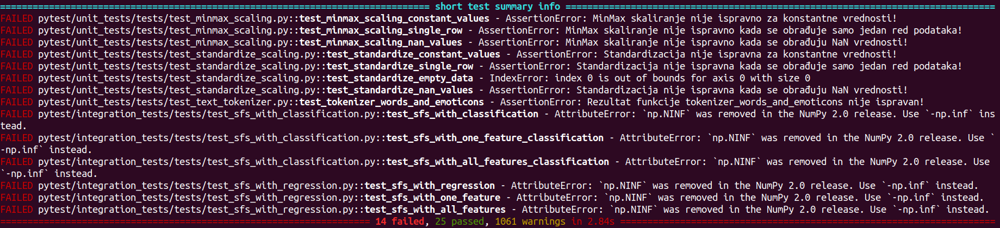

Detaljan izveštaj može se pogledati i u dokumentu [00_initial_testing_results.log](pytest/captured_logs/00_initial_testing_results.log) Možemo videti da su detektovani sledeći problemi:

1. U 6/14 navrata vidimo da korišćenje zastarelog konstrukta izaziva grešku, koja onemogućava program da nastavi izvršavanje:
    ```
    AttributeError: `np.NINF` was removed in the NumPy 2.0 release. Use `-np.inf` instead.
    ```

    Korišćenje `np.NINF` treba zameniti konstruktom `-np.inf`. Napomena da okruženje u kojem se testira koristi verziju biblioteke [NumPy 2.1.0](https://numpy.org/devdocs/release/2.1.0-notes.html#), te da se ovaj propust može donekle tolerisati, ako uzmemo u obzir da se u praksi i dalje često koriste verzije ove biblioteke 1.x. Ipak, ovo je neophodno promeniti kako bi se garantovalo izvršavanje na novijim sistemima, odnosno okruženjima koja koriste nove verzije popularnih biblioteka. Ove vrednosti su ispravljene gde god su pronađene u projektu.
2. Sledeći problem koji se javlja u testu `test_minmax_scaling_constant_values` je:
    ```
    AssertionError: MinMax skaliranje nije ispravno za konstantne vrednosti!
    ```
    Problem je što, za razliku od `0` vrednosti koje koristi *sklearn*, *mlxtend* rešava problem konstantnih vrednosti korišćenjem nedostajućih vrednosti (`nan`). Iako ne može da se tvrdi (pre integracionog testiranja) da je ovo neočekivano ponašanje i da kasnije mora dovesti do greške, svakako je zanimljiva razlika u dizajnu u odnosu na usvojeni standard. Takođe, može dovesti do problema ukoliko se ovaj tip skaliranja koristi pre primene algoritama iz neke druge biblioteke koja ne tretira isto nedostajuće i nula vrednosti, a svakako možemo pretpostaviti da će se najveći broj programera koji razvijaju neke nove pakete prikloniti odlukama korišćenijih biblioteka.

    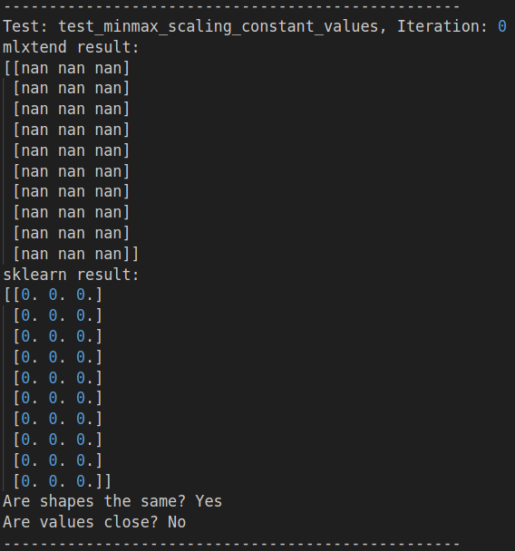
3. Naredni problem se javlja u `test_minmax_scaling_single_row` i u pitanju je:
    ```
    AssertionError: MinMax skaliranje nije ispravno kada se obrađuje samo jedan red podataka!
    ```
    Problem je sličan kao u prethodnom slučaju:

    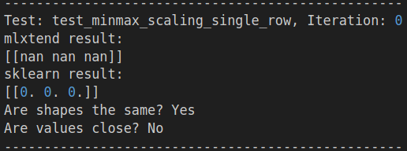
4. Naredni problem koji je takođe nastao zbog lošeg rada s `nan` vrednostima se javlja u `test_minmax_scaling_nan_values` i u pitanju je:
    ```
    AssertionError: MinMax skaliranje nije ispravno kada se obrađuju NaN vrednosti!
    ```
    Problem je sličan kao u prethodnom slučaju s tim što je sada situacija nešto složenija. Možemo primetiti da postojanje jedne nedostajuće vrednosti utiče na to da cela kolona biva popunjena nedostajućim vrednostima. Sa druge strane, u slučaju *sklearn* biblioteke, vrši se čišćenje tih vrednosti, pa se vrši skaliranje koristeći preostale vrednosti.

    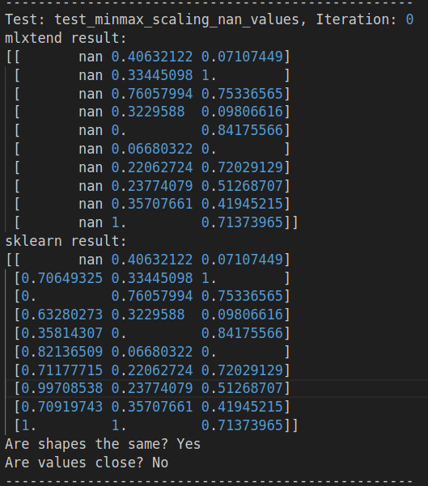

5. Greška u narednom testu (`test_standardize_constant_values`) signalizira sličan problem kao i problem pod rednim brojem 2. U pitanju je loš rad funkcije za standardizaciju vrednosti kada se funkciji proslede konstantne vrednosti:
    ```
    AssertionError: Standardizacija nije ispravna za konstantne vrednosti!
    ```
    Interesantno je da je u testovima koji su pisani u okviru biblioteke mlxtend nekoliko primera sa konstantnim vrednostima. Međutim, u svakom slučaju su testirane vrednosti 0, koje u ovom specifičnom slučaju rade okej. U svakom drugom slučaju konstantnih vrednosti dolazi do greške. Ovo će najbolje ilustrovati sledeća slika:

    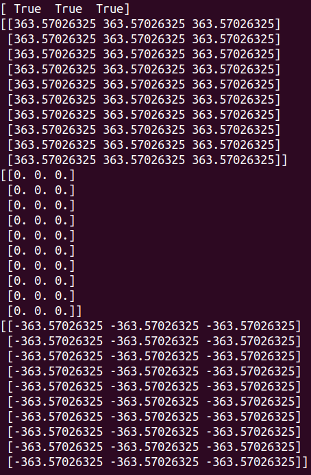
    
    Prvi niz `[True  True  True]` je rezultat izvršavanja linije:
    ```python
    are_constant = np.all(ary_newt[:, columns] == ary_newt[0, columns], axis=0)
    ```
    U ovoj liniji je uspešno izvršena provera da li se u kolonama nalaze konstantne vrednosti. Narednim linijama su vrednosti, kao što vidimo na slici, uspešno postavljene na nulu:
    ```python
    for c, b in zip(columns, are_constant):
        if b:
            ary_newt[:, c] = np.zeros(dim[0])
            parameters["stds"][c] = 1.0
    ```
    Ipak, nepažnja u narednoj liniji dovodi do greške:
    ```python
    ary_newt[:, columns] = (ary_newt[:, columns] - parameters["avgs"]) / parameters[
        "stds"
    ]
    ```
    Kao što vidimo, od 0 oduzimamo prosečnu vrednost, u ovom slučaju je to baš ta konstantna vrednost, tako da je rezultat izvršavanja ove funkcije samo negirana konstantna vrednost, umesto svih 0.
6. Naredni problem se javlja u testu `test_standardize_single_row`:
    ```
    AssertionError: Standardizacija nije ispravna kada se obrađuje samo jedan red podataka!
    ```
    Ovaj problem je potpuno analogan prethodnom problemu s obzirom na to da ukoliko imamo po jednu vrednost u svakoj koloni, te kolone se sastoje upravo od konstantnih vrednosti. Izlaz iz loga ovo demonstrira:
    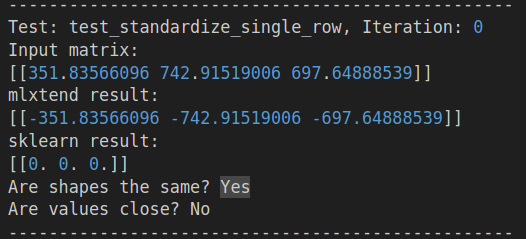

    Ovaj problem je rešen baš rešavanjem prethodnog problema.
7. Naredni problem se javlja u testu `test_standardize_empty_data` gde vidimo da nije dobro obrađen slučaj dobijanja prazne liste kao argumenta koji je potrebno standardizovati:
    ```
    IndexError: index 0 is out of bounds for axis 0 with size 0
    ```
8. Sledeći problem se javlja u testu `test_standardize_nan_values`:
    ```
    AssertionError: Standardizacija nije ispravna kada se obrađuju NaN vrednosti!
    ```
    Ovaj problem je analogan problemu 4 gde je postojanje `nan` vrednosti uticalo na to da cela kolona postane `nan`, stoga nema potrebe navoditi i sliku odgovarajućeg loga.
9. Poslednji detektovani problem napisanim testovima je problem u testu `test_tokenizer_words_and_emoticons`:
    ```
    AssertionError: Rezultat funkcije tokenizer_words_and_emoticons nije ispravan!
    ```
    Kao što možemo videti na narednoj slici, iako je napisanim regularnim izrazom dobro izvršena detekcija emotikona, u nastavku, zbog loše obrade tih rezultata, u rezultatu ostaju slova `p` i `d`, što ne bi trebalo da bude slučaj. Opet su u testovima napisanim u biblioteci zanemareni određeni slučajevi, s obzirom na to da u tim testovima nisu testirani emotikoni koji sadrže slova `p` i `D`, iako su obrađeni regularnim izrazom.
    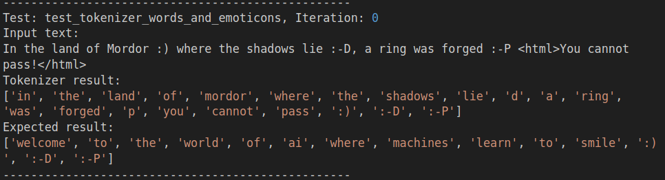


#### Upozorenja

Osim nemalog broja detektovanih grešaka, preostaje nam još i veliki broj upozorenja (`1062 warnings`), koje je potrebno adresirati. Na sledećoj slici se može videti kratak izveštaj o dobijenim upozorenjima. Odokativnom analizom, a takođe i sa ovog kratkog izveštaja možemo primetiti da je najčešće u pitanju zastarivanje određenih jezičkih konstrukta u narednim verzijama korišćenih biblioteka, ali ipak ima i onih upozorenja koji ukazuju na delove koda, koji potencijalno mogu praviti veće probleme.

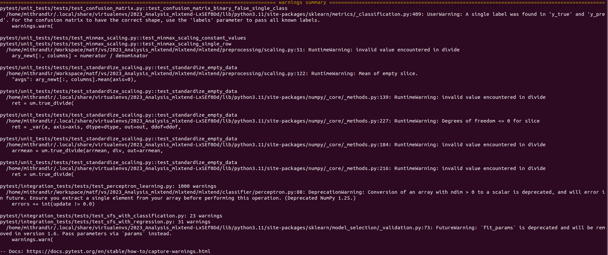

#### Pokrivenost koda

Kao što je napomenuto na početku, za pokrivenost je korišćen alat `coverage.py`. Pokretanjem pregleda pokrivenosti na sledeći način:
```
coverage run -m pytest unit_tests/tests/
coverage html
```
vrši se generisanje izveštaja o pokrivenosti koda u HTML formatu gde se pregledno može ispratiti stanje. Prilikom pokretanja pre ispravki navedenih grešaka i upozorenja dobijaju se rezultati, dostupni u svojoj celosti u dokumentu [initial_coverage_report/index.html](pytest/coverage_reports/initial_coverage_report/index.html). U skraćenom prikazu na sledećoj slici možemo videti da je pokrivenost koda oko 38%. Ukoliko zanemarimo naše datoteke iz foldera `pytest`, možemo primetiti da su funkcionalnosti koje smo testirali prilično dobro pokrivene, tj. sa veoma visokim procentima. 

*Treba napomenuti da je pokrivenost određenih delova koda samo trivijalna, jer se prilikom računanja pokrivenosti računaju i linije u kojima je na primer zapisana deklaracija funkcije.*

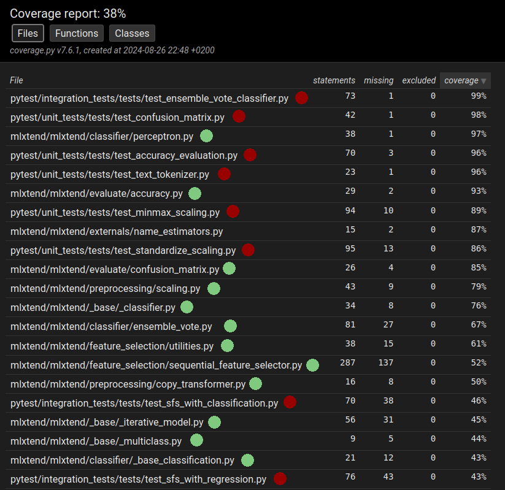

#### Otklanjanje grešaka i upozorenja

Sve navedene greške su ispravljene, kao i upozorenja i sve izmene su dostupne u zakrpi koda (eng. *patch*) dostupnoj u korenom direktorijumu - `mithrandir.patch`. U nastavku je kratko prodiskutovana ispravka svake od grešaka. Sve izmene su dostupne u *patch* datoteci gde se mogu pregledati. Za primenjivanje izmena iz *patch* datoteke potrebno je pokrenuti sledeću komandu (nakon pozicioniranja u *submodule*):

```shell
git apply ../mithrandir.patch
```

Za resetovanje, odnosno vraćanje na originalnu verziju biblioteke, potrebno je samo pokrenuti sledeću komandu (nakon pozicioniranja u *submodule*):

```shell
git checkout .
```

##### Otklanjanje grešaka

**(6 grešaka pod rednim brojem 1 iznad)** Nakon odgovarajuće promene (`np.NINF` treba zameniti konstruktom `-np.inf`) dobijamo novi rezultat testiranja. `SequentialFeatureSelector` sada uspešno prolazi sve testove. Takođe, ovaj zastareli konstrukt je bio prisutan i u klasi `ExhaustiveFeatureSelector`, te je ovom promenom rešen i taj potencijalni problem. Celokupan izveštaj se može videti u logu [00_testing_results_ninf_bugfix.log](pytest/captured_logs/00_testing_results_ninf_bugfix.log), a slika kratkog izveštaja neće biti navođena, jer je skup ostalih grešaka ostao nepromenjen.

**(2-4 iznad)** Nakon otklanjanja tih jednostavnih grešaka, na sledeći način rešavamo i probleme sa obradom `nan` vrednosti u funkciji `minmax_scaling()` iz datoteke `scaling.py`. Navedeni deo koda:

```python
numerator = ary_newt[:, columns] - ary_newt[:, columns].min(axis=0)
denominator = ary_newt[:, columns].max(axis=0) - ary_newt[:, columns].min(axis=0)
ary_newt[:, columns] = numerator / denominator

if not min_val == 0 and not max_val == 1:
    ary_newt[:, columns] = ary_newt[:, columns] * (max_val - min_val) + min_val

return ary_newt[:, columns]
```
menjamo sledećim linijama kojima rešavamo sve prethodno navedene probleme:
```python
for col in columns:
    col_data = ary_newt[:, col]

    # ignore nan values to scale non-nan values appropriately (like in sklearn)
    col_min = np.nanmin(col_data)
    col_max = np.nanmax(col_data)

    # avoid div by zero (when min == max)
    if col_max == col_min:
        ary_newt[:, col] = min_val
    else:
        scaled_data = (col_data - col_min) / (col_max - col_min)
        scaled_data = scaled_data * (max_val - min_val) + min_val

        ary_newt[:, col] = np.where(np.isnan(col_data), np.nan, scaled_data)

return ary_newt[:, columns]
```
**(5-6, 8 iznad)** Dva problema povezana sa načinom na koji standardizacija obrađuje konstantne vrednosti su prethodno gore detaljnije opisana, a rešavamo ih jednostavnom promenom. Poenta je da standardizovane vrednosti računamo samo ako vrednosti nisu konstantne. Uz ovo, rešićemo i problem sa radom sa nan vrednostima.

Originalni deo koda:
```python
for c, b in zip(columns, are_constant):
    if b:
        ary_newt[:, c] = np.zeros(dim[0])
        parameters["stds"][c] = 1.0
ary_newt[:, columns] = (ary_newt[:, columns] - parameters["avgs"]) / parameters[
    "stds"
]
```
Ispravka:
```python
for c, b in zip(columns, are_constant):
if b:
    ary_newt[:, c] = np.zeros(dim[0])
    parameters["stds"][c] = 1.0
else:
    non_nan_mask = ~np.isnan(ary_newt[:, c])
    ary_newt[non_nan_mask, c] = (ary_newt[non_nan_mask, c] - parameters["avgs"][c]) / parameters["stds"][c]
```

Prethodno, moramo izračunati parametre koristeći sve ne nan vrednosti, tako da moramo ažurirati i linije u kojima se računaju parametri.

Originalni deo koda:
```python
if params is not None:
    parameters = params
else:
    parameters = {
        "avgs": ary_newt[:, columns].mean(axis=0),
        "stds": ary_newt[:, columns].std(axis=0, ddof=ddof),
    }
```
Ispravka:
```python
if params is not None:
    parameters = params
else:
    parameters = {
        "avgs": np.nanmean(ary_newt[:, columns], axis=0),
        "stds": np.nanstd(ary_newt[:, columns], axis=0, ddof=ddof),
    }
```

**(7 iznad)** Da bismo rešili problem obrade prazne liste, samo dodajemo proveru na početku prethodno diskutovane funkcije `standardize()` i podižemo izuzetak `ValueError` (ažuriramo i dokumentaciju funkcije na odgovarajući način, prateći standarde):
```python
if array.size == 0:
    raise ValueError("Input array is empty. You cannot standardize an empty array.")
```

**(9 iznad)** Jedna od grešaka koje su rešavane je greška nastala prilikom prevođenja niske u niz koji sadrži reči i emotikone. Problem je bio što nakon detekcije odgovarajućih podniski, one nisu prečišćene pre konstruisanja finalnog niza. Izmenjena funkcija `tokenizer_words_and_emoticons()` sada pravilno obrađuje emotikone tako što ih prvo izdvaja iz teksta i uklanja. Tako se sprečava da njihovi delovi ostanu prisutni nakon čišćenja teksta. Nakon toga, tekst se pretvara u mala slova i uklanjaju se svi karakteri koji nisu reči, osim emotikona. Na kraju, očišćene reči i emotikoni se kombinuju u jednu listu. Ova izmena omogućava pravilno tokenizovanje teksta uz očuvanje celovitih emotikona. U nastavku navodimo originalno parče problematičnog koda i ispravku.
Originalni deo koda:
```python
text = re.sub(r"<[^>]*>", "", text)
emoticons = re.findall(r"(?::|;|=)(?:-)?(?:\)|\(|D|P)", text)
text = re.sub(r"[\W]+", " ", text.lower()) + " ".join(emoticons)
return text.split()
```
Ispravka:
```python
text = re.sub(r"<[^>]*>", "", text)
emoticons = re.findall(r"(?::|;|=)(?:-)?(?:\)|\(|D|P)", text)
for emoticon in emoticons:
    text = text.replace(emoticon, "")
text = re.sub(r"[\W]+", " ", text.lower())
result = text.split() + emoticons
return result
```

##### Otklanjanje upozorenja

Nekoliko upozorenja je rešeno implicitno rešavanjem prethodnih grešaka. Rešavanje preostalih upozorenja opisano je u nastavku.

Prvo upozorenje koje ćemo rešiti se pojavljuje zbog korišćenja `update != 0.0` u liniji `errors += int(update != 0.0)`. Pošto `update` može biti niz, poređenje direktno sa skalarnom vrednošću `(0.0)` koristeći `!=` može izazvati upozorenje u novijim verzijama biblioteke `NumPy`. Ovo se dešava jer `NumPy` obeshrabruje implicitnu konverziju nizova u skalarne vrednosti prilikom vršenja logičkih poređenja. Ovaj problem rešavamo jednostavnom promenom ove linije na sledeći način:
```python
errors += np.sum(update != 0.0)
```
Semantički, `update` je niz `bool` vrednosti, koje predstavljaju uspešnu ili pogrešnu klasifikaciju primera iz trenutnog niza slučajno odabranih primera (dakle, ovaj `numpy.array` sadrži vrednosti `True` ili `False`), tako da sumiranjem ovih vrednosti dobijamo odgovarajuću celobrojnu vrednost poštujući preporuke biblioteke `NumPy`.

Sledeće upozorenje je rešeno sitnom korekcijom u celom repozitorijumu prateći smernice biblioteke `sklearn`. Tačnije, svako prosleđivanje parametra `fit_params` prilikom poziva funkcije zamenjeno je sa `params`.

Konačno, nakon svih ispravki, pokretanjem testiranja dobijamo sledeći izlaz
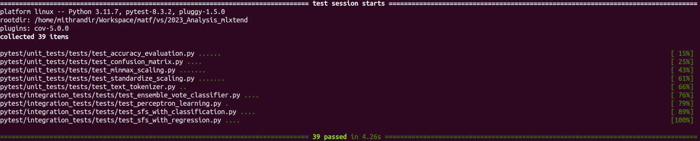

#### Pokrivenost

Nakon svih ispravki, ponovo pokrećemo alat coverage.py kako bismo videli nove podatke o pokrivenosti. U datoteci [final_coverage_report/index.html](pytest/coverage_reports/final_coverage_report/index.html) se nalazi prikaz dobijenih rezultata. Možemo primetiti da je ažuriran procenat pokrivenosti "odgovor na sve", odnosno tačno 42% (nije štelovano :))

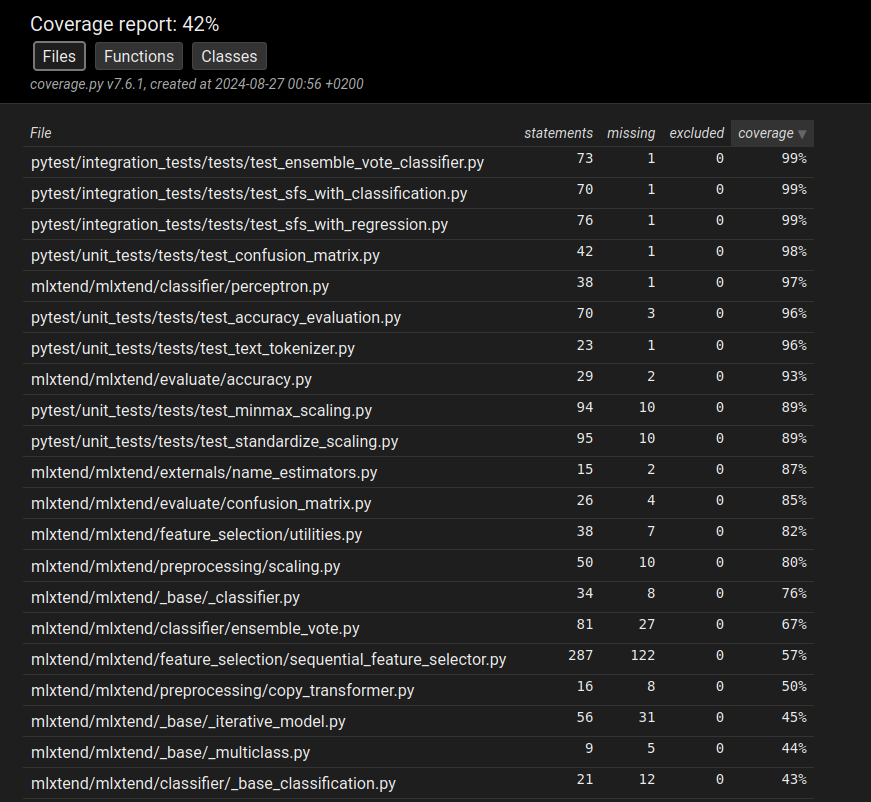

Naredni koraci za jedinično i integraciono testiranje bi bilo povećanje pokrivenosti što je više moguće. S obzirom na to da je ovolikom pokrivenošću detektovan nemali broj grešaka i upozorenja, razumno je misliti da bi se implementacijom novih, dobro osmišljenih testova, detektovao još veći broj grešaka i dodatno unapredio analizirani projekat.

## Pylint

`Pylint` je statički alat za analizu koda napisanog u programskom jeziku *Python*. Ovaj alat se koristi za proveru potencijalnih grešaka u kodu, za proveru ispravnosti stila pisanja, detekciju neupotrebljenog koda, optimizaciju i uopšteno, za poboljšanje kvaliteta koda. `Pylint` omogućava programerima da identifikuju probleme i usklade svoj kôd sa `PEP8` standardom, preporučenim standardom pisanja *Python* koda. `Pylint` takođe omogućava programeru da svesno ignoriše određena pravila za koja je svestan da krši, ukoliko za to postoji valjani razlog. To se može učiniti navođenjem potrebnih opcija prilikom pokretanja analize. Ono što je specifično za ovaj alat je nešto sporije izvršavanje u odnosu na druge alate, kako i sami autori navode:
>pylint, not afraid of being a little slower than it already is, is also a lot more thorough than other linters.

Sporost izvršavanja se lako podnosi kada se uzmu u obzir benefiti korišćenja ovog alata. Ipak, sami autori preporučuju alate, koji se mogu koristiti samostalno ili u sprezi sa ovim alatom. Neki od njih su: [ruff](https://github.com/charliermarsh/ruff), [flake8](https://github.com/PyCQA/flake8), [mypy](https://github.com/python/mypy), itd.

### Šta je **linting**?

*Linting* je proces analize izvornog koda radi identifikacije potencijalnih grešaka, stilskih odstupanja i drugih problema pre nego što se kôd pokrene. Cilj lintinga je unapređenje kvaliteta koda i prevencija grešaka koje mogu nastati tokom njegovog izvršavanja. U *Python* zajednici, `Pylint` je jedan od najpoznatijih alata za *linting*, uz gore navedene alate. Pored navedenih postoji veliki broj alata za ovu namenu.

### Prva pokretanja

Inicijalnim pokretanjem *linting* analize, pre bilo kakvih ispravki i bez korišćenja dodatnih opcija, dobija se pregršt upozorenja, ali i nemali broj potencijalnih grešaka. Takođe, na osnovu celokupne analize dobija se ocena koja označava koliko je kvalitetan kôd koji se analizira. Inicijalna ocena je **7.19/10**, a izveštaj je dostupan u datoteci [00_pylint_initial_report.txt](pylint/reports/00_pylint_initial_report.txt). Zanimljivo (ili ne), nakon svih izmena i ispravki bagova, koji su otkriveni jediničnim i integracionim testiranjem, a zatim ponovnog pokretanja *linting* analize, ocena je ostala identična ([01_pylint_bugs_fixed_report.txt](pylint/reports/01_pylint_bugs_fixed_report.txt)). 

```
Your code has been rated at 7.19/10 (previous run: 7.19/10, +0.00)
```

Pokretanja ovog alata se mogu učiniti dosta smislenijim ukoliko se prilagodi konkretnom projektu koji se analizira. Na primer, u projektu mašinskog učenja je ustaljeno i očekivano pojavljivanje imena promenljivih koja počinju velikim slovom (npr. baratanje matricama), a možemo primetiti veliki broj preporuka koje ukazuju baš na to. Potrebno je dakle prilagoditi upotrebu ovog alata primenom odgovarajućih opcija. Da bi se ispoštovale smernice autora biblioteke, koristiće se slične opcije za ograničavanje preporuka koje su korišćene u konfiguracionoj datoteci za alat `flake8`, koji je korišćen u glavnom repozitorijumu, a zatim će se izvršiti neka dodatna prilagođavanja. Mnoge stvari biće ispravljene.

### Dodavanje opcija za analiziranje projekta

Kako bismo započeli dodavanje željenih ograničenja za provere, prvo generišemo datoteku `.pylintrc` sa podrazumevanim vrednostima korišćenjem sledeće komande:

```
pylint --generate-rcfile > .pylintrc
```

Dodate su naredne opcije, kako bi se ispratila uputstva iz konfiguracione datoteke za alat `flake8`:

```
[MESSAGES CONTROL]

enable = C, E, F, W
disable=...
    C0326, C0330, C0301, W0401, W0614, R0912, R, I

[FORMAT]

max-line-length=89  # PROMENJENO sa 100
```

Značenja ovih kodova su sledeća:
- C: praćenje konvencije;
- E: sintaksne greške, neispravno korišćenje varijabli, itd.
- F: označava fatalne greške, tj. greške zbog kojih `pylint` nije u stanju da nastavi analizu koda (npr. nedostajući fajlove ili moduli koje je `pylint` pokušao da učita i analizira) i ove greške zahtevaju hitno ispravljanje;
- W: ova oznaka se koristi za upozorenja koja označavaju potencijalne probleme u kodu;
- C0326 (bad-whitespace): ova opcija se odnosi na provere neodgovarajućeg ili nepravilnog razmaka u kodu;
- C0330 (bad-continuation): ova opcija detektuje loše formatirane linije koda prilikom preloma linija;
- C0301 (line-too-long): predugačka linija;
- W0401 (wildcard-import): `pylint` prijavljuje upozorenje kada se koristi generički uvoz (`import *`). Ovaj stil uvoza može dovesti do konfuzije i problema u kodu jer nije jasno koje tačno funkcije ili klase se uvoze;
- W0614 (unused-import): ova opcija detektuje kada je modul ili objekat uvezen, ali se ne koristi nigde u kodu
- R0912 (too-many-branches): kada funkcija ili metoda ima previše grana, odnosno funkcije su potencijaln prekomplikovane;
- R (refactor): ova kategorija pokriva sve preporuke za refaktorisanje koda, kao što su funkcije sa previše parametara, previše grana, ili duboke ugnježdene strukture;
- I (ignored): ova opcija ukazuje na deo koda koji je ignorisan ili isključen iz `pylint` analize putem specifičnih komentara (npr. `# pylint: disable=C0326`), pošto se takvim eksplicitnim navođem naglašava `pylint`-u da tu liniju ne uključi u izveštaj.

Dodata su i imena promenljivih za koje ima smisla koristiti velika slova, a pronađena su u projektu:

```
[VARIABLES]

good-names= X,X_train,X_test,X_data,X_1,X_2,X_dataset,R,X_boot,X_cols,
            sAC,sA,sC,Xb,Q,R,X_tr,X_fl,X_ary,check_Xy,X_pos,X_neg,L1_term,L2_term,
            grad_W_1,grad_B_1,grad_W_out,grad_B_out,dW_1,dB_1,dW_out,dB_out,
            A,B,A_mA,B_mB,ssA,ssB,names_cols_A,names_cols_B,X_pca,X_predict,
            Z,X_highlight,X_grid,copy_X,X_projected_,X_,K,N,S_W,S_B,IDX,conf_AC,conf_CA
```

Dalje, dodajemo sledeću opciju prilikom pokretanja alata `--extension-pkg-whitelist=numpy` da bismo izbegli prikazivanje određenih upozorenja, koja su praktično lažna upozorenja nastala u starijim verzijama ovog alata, te je počev od neke od novijih verzija dodata mogućnost korišćenja ove opcije za ispravan rad sa `NumPy` bibliotekom, odnosno ispravnu analizu.

*Tokom rada, može biti korisno isključiti obaveštenja koja generišu dosta upozorenja i grešaka poput `C0114 (missing-module-docstring)`, koja naglašava da se ne prati standard za dokumentovanje modula.*

### Ponovno pokretanje analize

Nakon ovih dodatih opcija, pokrećemo analizu na sledeći način (nakon što smo primenili odgovarajući *patch*):

```
pylint --extension-pkg-whitelist=numpy \
    mlxtend/mlxtend \
    > pylint/reports/02_pylint_options_added_report.txt
```

Analiza daje rezultate dostupne u datoteci [02_pylint_options_added_report.txt](pylint/reports/02_pylint_options_added_report.txt). Vidimo da je nakon prilagođavanja analize konkretnom projektu, ocena projekta znatno bolja, što je i očekivano:

```
Your code has been rated at 8.40/10 (previous run: 8.40/10, +1.21)
```

U nastavku će se pristupiti korekcijama, prateći smernice iz ovog izveštaja.

### Ispravke

1. Prvi tip ispravki koji je vršen je reformatiranje stringova u moderniju verziju `f-string`, koja umnogome povećava čitljivost tih delova koda. Upozorenje izgleda ovako:

    ```
    mlxtend/mlxtend/text/names.py:103:17: C0209: Formatting a regular string which could be an f-string (consider-using-f-string)
    ```

    Pronađeno je oko 100 ovakvih situacija. Ispravke su vršene uz pomoć alata `GitHub Copilot`, a u nastavku sledeći primer originalnog koda i ispravke:

    ```python
    raise ValueError(
        "The `method` must " "be in %s. Got %s." % (allowed_methods, method)
    )
    ```

    Ispravka:

    ```python
    raise ValueError(
        f"The `method` must be in {allowed_methods}. Got {method}."
    )
    ```

2. Sledeći primer koda koji možemo srediti je primer nedostižnog koda. Ovo se dogodilo samo jednom u projektu i uklonjeno je, a u pitanju je bila nedostižna return naredba, jer će se prehodno vratiti izuzetak:

    ```
    mlxtend/mlxtend/externals/adjust_text.py:637:12: W0101: Unreachable code (unreachable)
    ```

    ```python
    try:
        add_bboxes = get_bboxes(add_objects, r, (1, 1), ax)
    except ValueError:
        raise ValueError(
            "Can't get bounding boxes from add_objects - is'\
                        it a flat list of matplotlib objects?"
        )
        return
    ```

3. Detektovano je oko 30 primera implicitne konkatenacije stringova:

    ```
    mlxtend/mlxtend/evaluate/lift_score.py:60:0: W1404: Implicit string concatenation found in call (implicit-str-concat)
    ```

    Primer, koji se rešava samo spajanjem ovog stringa u jedan:

    ```python
    "`y_target` and `y_predicted`" "don't have the same number of elements."
    ```

4. Još jedno upozorenje jedino svoje vrste nam ukazuje na nepotrebno ugnježdavanje funkcija `min()` i `max()`. Ovakav ugnježdeni poziv funkcija možemo izbeći korišćenjem operatora `*` za raspakivanje vrednosti prilikom poziva funkcije.

    ```
    mlxtend/mlxtend/plotting/learning_curves.py:150:20: W3301: Do not use nested call of 'max'; it's possible to do 'max(*test_errors, *training_errors)' instead (nested-min-max)
    mlxtend/mlxtend/plotting/learning_curves.py:151:20: W3301: Do not use nested call of 'min'; it's possible to do 'min(*test_errors, *training_errors)' instead (nested-min-max)
    ```

    Originalni deo koda:
    
    ```python
    max_y = max(max(test_errors), max(training_errors))
    min_y = min(min(test_errors), min(training_errors))
    ```

    Ispravka:

    ```python
    max_y = max(*test_errors, *training_errors)
    min_y = min(*test_errors, *training_errors)
    ```

5. Primer nekorišćene promenljive se javlja u 27 navrata, međutim ispravljeno je samo na jednom mestu, samo radi demonstracije. Takođe, na mnogim mestima, iako se ne koristi, na neki način povećava čitljivost koda, jer ime promenljive bliže određuje šta se zapravo računa u petlji. U slučajevima gde se koriste trivijalne promenljive poput `i` u ovom slučaju, ovo komotno možemo promeniti u `_`, jer ne nosi nikakvu informaciju, a korišenjem `_` ova vrednost će biti ignorisana.

    ```
    mlxtend/mlxtend/evaluate/f_test.py:194:8: W0612: Unused variable 'i' (unused-variable)
    ```

    ```python
    # originalni kod
    for i in range(5):
    # ispravka
    for _ in range(5):
    ```

### Završno pokretanje analize

Na kraju, nakon svih ovih ispravki, pokrećemo ponovno izvršavanje analize (nakon što smo primenili odgovarajući *patch*):

```
pylint --extension-pkg-whitelist=numpy \
    mlxtend/mlxtend \
    > pylint/reports/03_pylint_final_report.txt
```

Dobijamo rezultate koji su dostupni u izveštaju [03_pylint_final_report.txt](pylint/reports/03_pylint_final_report.txt) i dobijena je sledeća konačna ocena.

```
Your code has been rated at 8.72/10 (previous run: 8.40/10, +0.32)
```

### Zaključak

Može se zaključiti da je projekat već bio u jako dobrom stanju što se tiče praćenja raznih standarda za razvoj *Python* projekta, ali je bilo moguće ovo dodatno popraviti, što je i učinjeno u ovom projektu. A ove ispravke su dodate na ispravke izvršene nakon jediničnog i integracionog testiranja te je sve zajedno dostupno u patch datoteci [mithrandir-linting.patch](mithrandir-linting.patch).

## `cProfile` + `SnakeViz`

### Zaključci
Zaključci o upotrebi Alata Z.

## `py-spy`

### Zaključci
Zaključci o upotrebi Alata W.


## Zaključak


